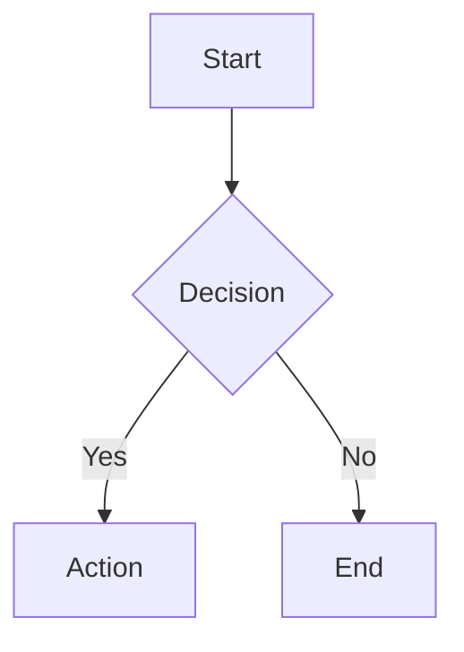
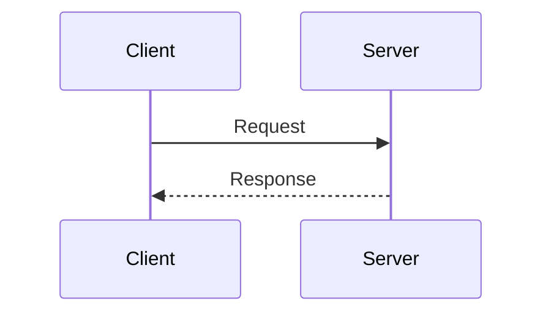

# MkDocs Material Syntax Reference

Quick reference for MkDocs Material formatting patterns.

## Admonitions

**Basic syntax:**
```markdown
!!! note "Optional Title"
    Content indented with 4 spaces.
    Multiple paragraphs supported.
```

**Collapsible (details):**
```markdown
??? note "Click to expand"
    Hidden by default.

???+ warning "Expanded by default"
    Use `+` after `???` to start open.
```

**Types:** `note`, `abstract`, `info`, `tip`, `success`, `question`, `warning`, `failure`, `danger`, `bug`, `example`, `quote`

**Inline (no title):**
```markdown
!!! tip ""
    Content without title bar.
```

## Code Blocks

**With title and line numbers:**
````markdown
```python title="example.py" linenums="1"
def hello():
    return "Hello, World!"
```
````

**Highlight specific lines:**
````markdown
```python hl_lines="2 3"
def example():
    highlighted = True  # line 2
    also_highlighted = True  # line 3
```
````

**Line number start:**
````markdown
```python linenums="10"
# Starts at line 10
```
````

**Code annotations:**
````markdown
```python
def example():
    value = compute()  # (1)!
```

1. This annotation explains the line.
````

## Content Tabs

**Basic tabs:**
```markdown
=== "Tab 1"
    Content for tab 1.

=== "Tab 2"
    Content for tab 2.
```

**Code tabs (common pattern):**
````markdown
=== "Python"
    ```python
    print("Hello")
    ```

=== "JavaScript"
    ```javascript
    console.log("Hello");
    ```
````

## Tables

**Standard markdown:**
```markdown
| Header 1 | Header 2 | Header 3 |
|----------|----------|----------|
| Cell 1   | Cell 2   | Cell 3   |
| Cell 4   | Cell 5   | Cell 6   |
```

**Alignment:**
```markdown
| Left | Center | Right |
|:-----|:------:|------:|
| L    |   C    |     R |
```

## Mermaid Diagrams

**Flowchart:**
````markdown

````

**Sequence diagram:**
````markdown

````

## Links and References

**Internal links:**
```markdown
[Link text](relative/path/to/page.md)
[Section link](page.md#section-anchor)
```

**Reference-style:**
```markdown
[Link text][ref-id]

[ref-id]: path/to/page.md "Optional title"
```

## Images

**Basic:**
```markdown

```

**With attributes:**
```markdown
{ width="300" align="left" }
```

## Lists

**Task lists:**
```markdown
- [x] Completed task
- [ ] Incomplete task
```

**Definition lists:**
```markdown
Term
:   Definition of the term.
    Can have multiple paragraphs.
```

## Other Features

```markdown
++ctrl+alt+del++              # Keyboard keys
==highlighted text==          # Highlighting
~~deleted text~~              # Strikethrough
H~2~O  E=mc^2^               # Sub/superscript
:material-account-circle:     # Icons
*[HTML]: Hyper Text Markup   # Abbreviations
```
