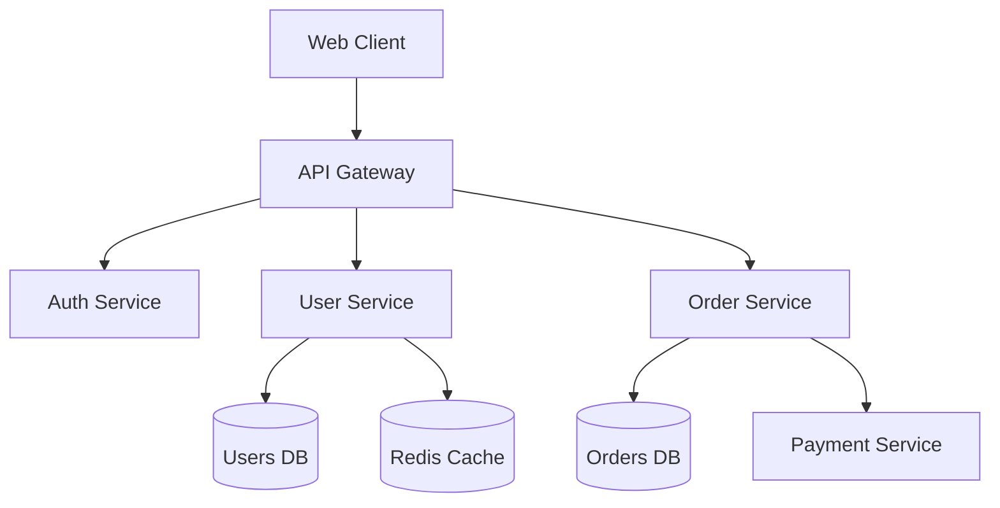
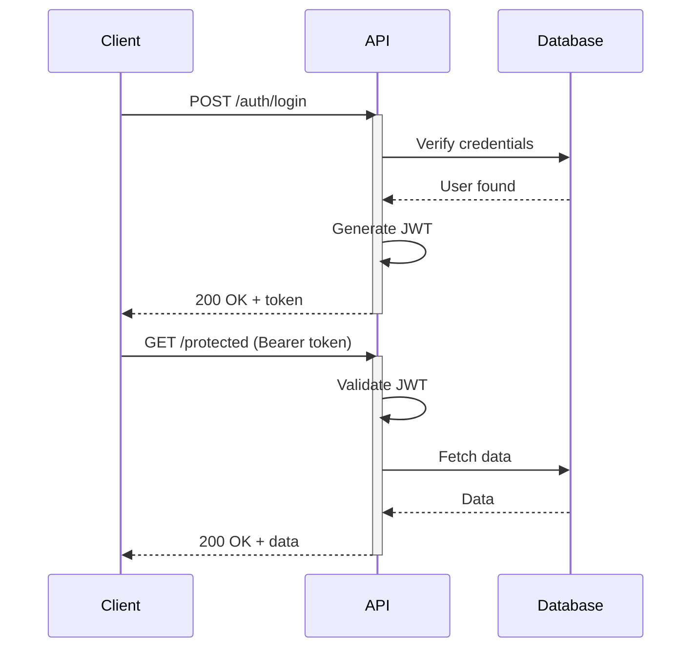
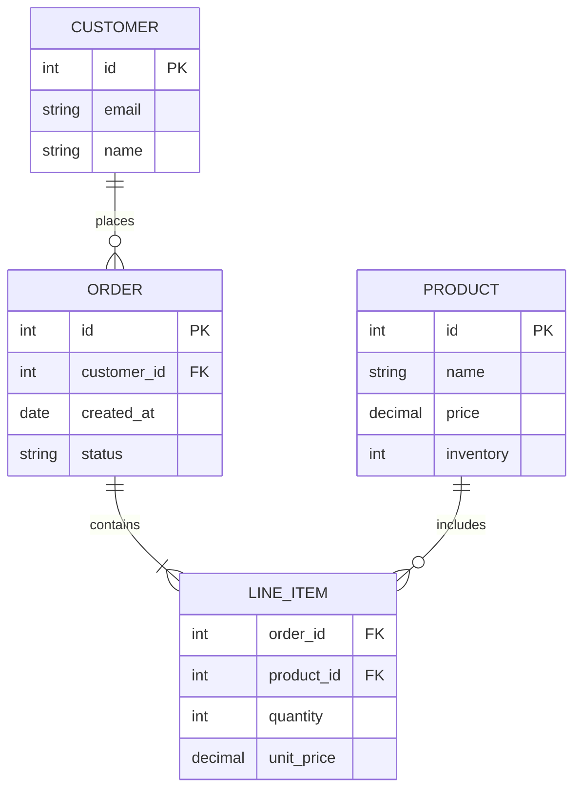
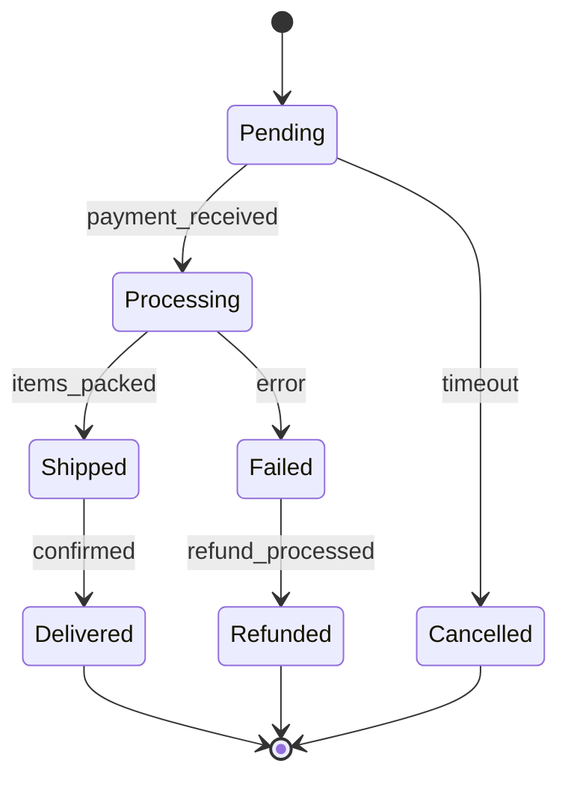
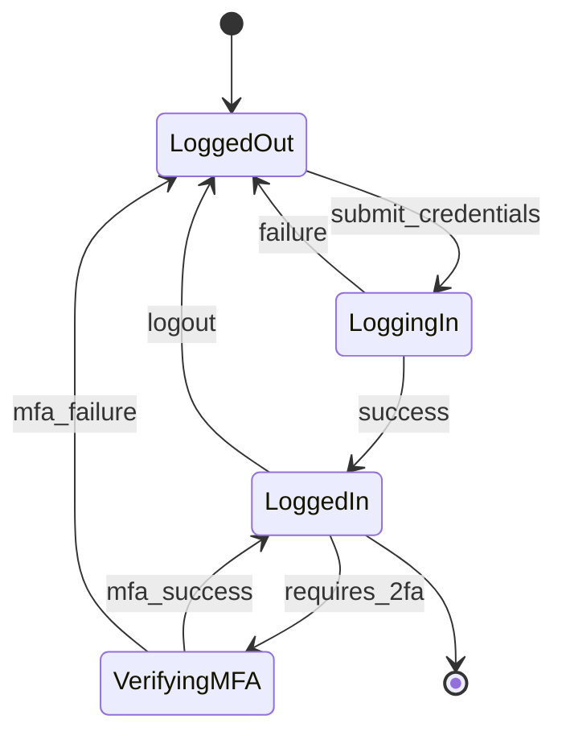
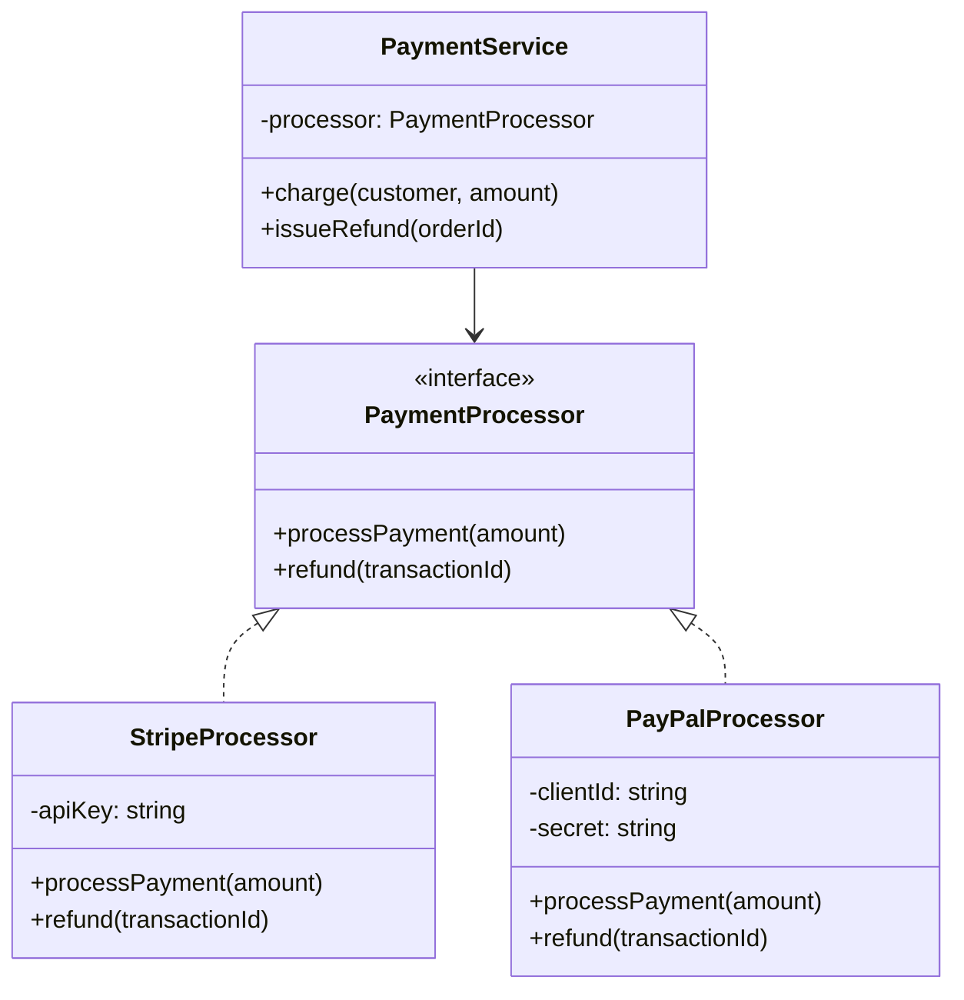
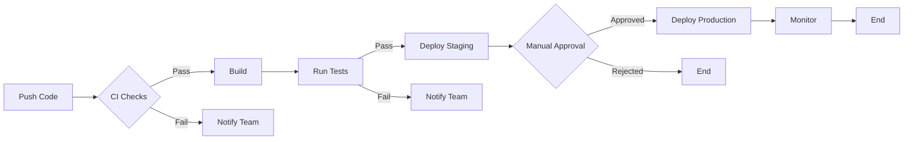

# Mermaid.js Examples: Core Diagrams

Real-world patterns for common documentation scenarios.

## Software Architecture

**Microservices Architecture:**


## API Documentation

**Authentication Flow:**


**REST API Endpoints:**
```mermaid
flowchart LR
  API[API]
  Users[/users]
  Posts[/posts]
  Comments[/comments]

  API --> Users
  API --> Posts
  API --> Comments

  Users --> U1[GET /users]
  Users --> U2[POST /users]
  Users --> U3[GET /users/:id]
  Users --> U4[PUT /users/:id]
  Users --> U5[DELETE /users/:id]
```

## Database Design

**E-Commerce Schema:**


## State Machines

**Order Processing:**


**User Authentication States:**


## Object-Oriented Design

**Payment System Classes:**


## CI/CD Pipeline

**Deployment Flow:**

