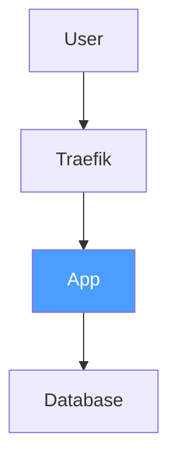
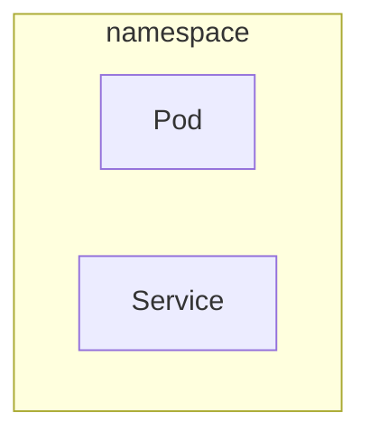

# Mermaid Diagrams

**REQUIRED SUB-SKILL:** Use `mermaidjs-v11` for all diagram creation — it has comprehensive syntax, styling, and diagram type coverage.

## Configuration

```yaml
# mkdocs.yml
markdown_extensions:
  - pymdownx.superfences:
      custom_fences:
        - name: mermaid
          class: mermaid
          format: !!python/name:pymdownx.superfences.fence_code_format
```

## Diagram Size Rules

**Max 15 lines/nodes per diagram.** Larger diagrams must be split:

1. **Overview diagram** — 5-7 top-level blocks, no internals, use `style` for color
2. **Deep-dive diagrams** — one per component, show internal structure
3. Store split diagrams in `docs/architecture/_includes/`
4. Reference via `` (see [includes.md](includes.md))

### Good: Focused Overview



### Bad: Everything in One Diagram

Do NOT create diagrams with 20+ nodes, multiple subgraphs with internal details, and cross-cutting edges all in one block. Split into overview + deep-dives.

## Quick Syntax

**Direction:** `TB` (top-bottom), `LR` (left-right), `BT`, `RL`

**Nodes:** `[rect]` `(rounded)` `{diamond}` `((circle))`

**Edges:** `-->` solid, `-.->` dashed, `==>` thick, `-->|"label"|` labeled

**Subgraphs:**


**Styling:**
```
style nodeName fill:#hex,color:#fff
```

## Diagram Types

For comprehensive syntax on all 24+ diagram types (flowcharts, sequence, state, ER, Gantt, timeline, architecture), invoke the `mermaidjs-v11` skill.
