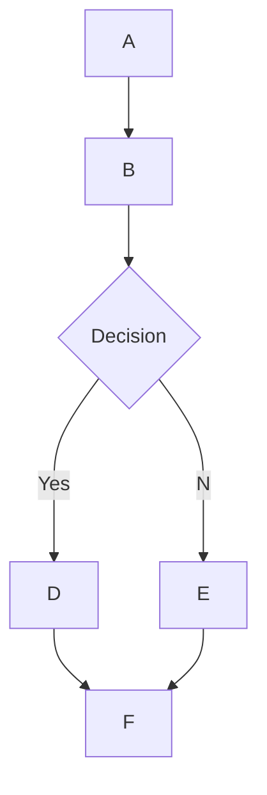

# Artifacts

## What are Artifacts and how do I use them in Open WebUI?

Artifacts in Open WebUI are an innovative feature inspired by Claude.AI's Artifacts, allowing you to interact with significant and standalone content generated by an LLM within a chat. They enable you to view, modify, build upon, or reference substantial pieces of content separately from the main conversation, making it easier to work with complex outputs and ensuring that you can revisit important information later.

## When does Open WebUI use Artifacts?

Open WebUI creates an Artifact when the generated content meets specific criteria tailored to our platform:

1. **Renderable**: To be displayed as an Artifact, the content must be in a format that Open WebUI supports for rendering. This includes:

- Single-page HTML websites
- Scalable Vector Graphics (SVG) images
- Complete webpages, which include HTML, Javascript, and CSS all in the same Artifact. Do note that HTML is required if generating a complete webpage.
- ThreeJS Visualizations and other JavaScript visualization libraries such as D3.js.

Other content types like Documents (Markdown or Plain Text), Code snippets, and React components are not rendered as Artifacts by Open WebUI.

## How does Open WebUI's model create Artifacts?

To use artifacts in Open WebUI, a model must provide content that triggers the rendering process to create an artifact. This involves generating valid HTML, SVG code, or other supported formats for artifact rendering. When the generated content meets the criteria mentioned above, Open WebUI will display it as an interactive Artifact.

## How do I use Artifacts in Open WebUI?

When Open WebUI creates an Artifact, you'll see the content displayed in a dedicated Artifacts window to the right side of the main chat. Here's how to interact with Artifacts:

- **Editing and iterating**: Ask an LLM within the chat to edit or iterate on the content, and these updates will be displayed directly in the Artifact window. You can switch between versions using the version selector at the bottom left of the Artifact. Each edit creates a new version, allowing you to track changes using the version selector.
- **Updates**: Open WebUI may update an existing Artifact based on your messages. The Artifact window will display the latest content.
- **Actions**: Access additional actions for the Artifact, such as copying the content or opening the artifact in full screen, located in the lower right corner of the Artifact.

## Editing Artifacts

1. **Targeted Updates**: Describe what you want changed and where. For example:
   - "Change the color of the bar in the chart from blue to red."
   - "Update the title of the SVG image to 'New Title'."

2. **Full Rewrites**: Request major changes affecting most of the content for substantial restructuring or multiple section updates. For example:
   - "Rewrite this single-page HTML website to be a landing page instead."
   - "Redesign this SVG so that it's animated using ThreeJS."

**Best Practices**:
- Be specific about which part of the Artifact you want to change.
- Reference unique identifying text around your desired change for targeted updates.
- Consider whether a small update or full rewrite is more appropriate for your needs.

## Use Cases

- **Designers**: Create interactive SVG graphics for UI/UX design. Design single-page HTML websites or landing pages.
- **Developers**: Create simple HTML prototypes or generate SVG icons for projects.
- **Marketers**: Design campaign landing pages with performance metrics. Create SVG graphics for ad creatives or social media posts.

## Example Projects

1. **Interactive Visualizations** -- Components: ThreeJS, D3.js, SVG. Build interactive line charts, data visualizations with version tracking.
2. **Single-Page Web Applications** -- Components: HTML, CSS, JavaScript. Build to-do list apps, dashboards with interactive functionality.
3. **Animated SVG Graphics** -- Components: SVG and ThreeJS. Create animated logos and marketing graphics.
4. **Webpage Prototypes** -- Components: HTML, CSS, JavaScript. Build and test e-commerce website prototypes.
5. **Interactive Storytelling** -- Components: HTML, CSS, JavaScript. Create stories with scrolling effects and animations.

## Troubleshooting

### Artifacts Preview Not Working (Uncaught SecurityError)

If you encounter an issue where the code preview in the chat interface does not appear and you see an error like `Artifacts.svelte:40 Uncaught SecurityError` in the browser console, this is commonly caused by cross-origin iframe restrictions in certain environment configurations.

**Solution:**

1. Go to **Settings > Interface**.
2. Toggle on **Allow Iframe Sandbox Same-Origin Access**.
3. Save your settings.

---

# MermaidJS Rendering

## Overview

Open WebUI supports rendering of visually appealing MermaidJS diagrams, flowcharts, pie charts and more, directly within the chat interface. MermaidJS is a powerful tool for visualizing complex information and ideas, and when paired with the capabilities of a large language model (LLM), it can be a powerful tool for generating and exploring new ideas.

## Using MermaidJS in Open WebUI

To generate a MermaidJS diagram, simply ask an LLM within any chat to create a diagram or chart using MermaidJS. For example, you can ask the LLM to:

- "Create a flowchart for a simple decision-making process for me using Mermaid. Explain how the flowchart works."
- "Use Mermaid to visualize a decision tree to determine whether it's suitable to go for a walk outside."

Note that for the LLM's response to be rendered correctly, it must begin with the word `mermaid` followed by the MermaidJS code. You can reference the [MermaidJS documentation](https://mermaid.js.org/intro/) to ensure the syntax is correct and provide structured prompts to the LLM to guide it towards generating better MermaidJS syntax.

## Visualizing MermaidJS Code Directly in the Chat

When you request a MermaidJS visualization, the LLM will generate the necessary code. Open WebUI will automatically render the visualization directly within the chat interface, as long as the code uses valid MermaidJS syntax.

If the model generates MermaidJS syntax, but the visualization does not render, it usually indicates a syntax error in the code. You'll be notified of any errors once the response has been fully generated.

## Interacting with Your Visualization

Once your visualization is displayed, you can:

- Zoom in and out to examine it more closely.
- Copy the original MermaidJS code used to generate the visualization by clicking the copy button at the top-right corner of the display area.

### Example

Experimenting with different types of diagrams and charts can help you develop a more nuanced understanding of how to effectively leverage MermaidJS within Open WebUI. For smaller models, consider referencing the [MermaidJS documentation](https://mermaid.js.org/intro/) to provide guidance for the LLM, or have it summarize the documentation into comprehensive notes or a system prompt.
