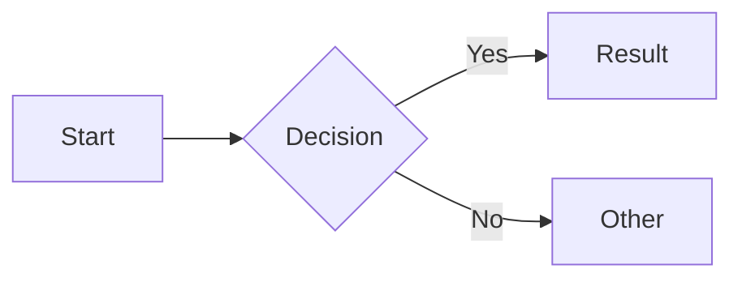

# Images

Extensions: `attr_list`, `md_in_html`, `pymdownx.blocks.caption`.

## Alignment

```markdown
{ align=left }
{ align=right }
```

No centered alignment via `align` attribute. On mobile, images stretch to full width.

## Captions

HTML approach:
```html
<figure markdown>
  
  <figcaption>Caption text</figcaption>
</figure>
```

Caption extension:
```markdown

/// caption
Caption text
///
```

## Lazy Loading

```markdown
{ loading=lazy }
```

## Light/Dark Mode

```markdown


```

---

# Icons & Emojis

Extensions: `attr_list`, `pymdownx.emoji` (with Twemoji settings).

10,000+ icons from 5 bundled sets: **Lucide** (lucide.dev), **Material Design** (Pictogrammers), **FontAwesome** (free), **Octicons** (GitHub), **Simple Icons** (brands).

## Emojis

```markdown
:smile:  :rocket:  :thumbsup:
```

## Icons

```markdown
:fontawesome-regular-face-laugh-wink:
:lucide-braces:
:material-account-circle:
:octicons-heart-fill-24:
:simple-python:
```

## Styled Icons

```markdown
:fontawesome-brands-youtube:{ .youtube }
```

CSS: `.youtube { color: #EE0F0F; }` (add via `extra_css`).

## Custom Icons

Place SVGs in `overrides/.icons/`, reference as `:custom-icon-name:`.

---

# Diagrams (Mermaid)

Extension: `pymdownx.superfences` with mermaid custom fence.

Officially supported types: flowcharts, sequence diagrams, state diagrams, class diagrams, entity-relationship diagrams. Other types (pie, gantt, user journey, git graph) work but aren't mobile-optimized.

````markdown

````

Mermaid auto-uses configured fonts/colors, works with instant navigation, supports light/dark schemes. Extend via `extra_javascript` (e.g., ELK layouts).

---

# Math

Extension: `pymdownx.arithmatex` with `generic: true`.

Choose MathJax or KaTeX (add via `extra_javascript`).

**Block:** `$$ \cos x = \sum_{k=0}^{\infty} ... $$`

**Inline:** `The function $f(x) = x^2$`

| | KaTeX | MathJax |
|---|---|---|
| Speed | Faster | Slower |
| Syntax | LaTeX subset | LaTeX + AsciiMath + MathML |
| Accessibility | Limited | Better (MathML) |
